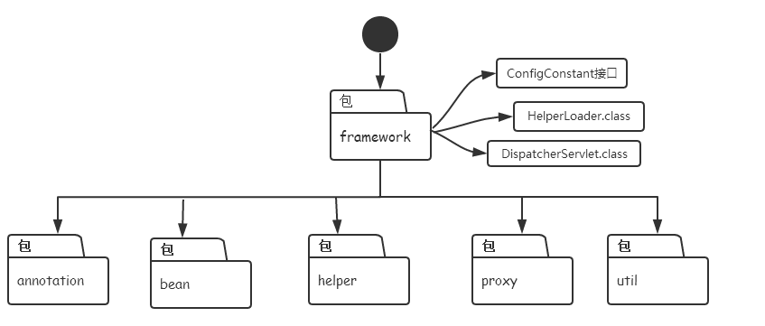

# Rock Framework

## 简介
Rock Framework是本人练手做的一个简易 Java Web框架(基于Servlet3.0开发)，其实现了一些Web框架所具备的简单基本功能。它实现了以下功能特性：

 - http请求解析和转发
 - 可加载并从文件中读取配置
 - 框架内置MVC特性
 - 实现控制反转IOC和依赖注入DI的功能
 - 框架具有AOP(Aspect oriented programming 面向切面编程)特性
 - 开发基于Java注解进行配置



框架结构如上所示

## 使用(测试)说明
框架非常易于使用

### 1.创建Maven Web工程

```
smart-sample/
　　┗ src/
　　　　┗ main/
　　　　　　┗ java/
　　　　　　┗ resources/
　　　　　　┗ webapp/
　　┗ pom.xml
```

假若我们创建了一个项目，java目录下是以下结构

```
com/
　　┗ rocklct/
　　　　┗ demo/
　　　　　　┗ view/
　　　　　　┗ controller/
　　　　　　┗ service/
```

此时的基础包名为com.rocklct.demo,之后的配置会用到它。

### 2.添加框架jar到maven本地依赖
由于这个框架没有发布，所以只能自行编译并且发布到本地仓库中以供测试。

我们首先需要用maven命令package整个框架成为一个jar包。然后发布jar包到maven本地仓库。

发布的命令如下

```
mvn install:install-file -Dfile=rock-framework-1.0.0.jar -DgroupId=com.rocklct -DartifactId=rock-framework -Dversion=1.0.0 -Dpackaging=jar -DgeneratePom=true
```

发布完成以后，我们就可以在demo项目中配置Maven依赖，编辑`pom.xml`文件

```
<dependency>
    <groupId>com.rocklct</groupId>
    <artifactId>rock-framework</artifactId>
    <version>1.0.0</version>
</dependency>
```

### 3.编写rock-framework配置文件
在resources目录下，创建一个rock.properties文件。

以下是example

```
rock.framework.jdbc.driver=com.mysql.jdbc.Driver
rock.framework.jdbc.url=jdbc:mysql://localhost:3306/demo
rock.framework.jdbc.username=root
rock.framework.jdbc.password=rocklct

rock.framework.app.base_package=com.rocklct.demo
rock.framework.app.jsp_path=/WEB-INF/view/
rock.framework.app.asset_path=/asset/
```

根据项目不同，可以修改以上配置。

### 4.编写代码

以下是Controller类的一个example

``` java
@Controller
public class HelloWorldController {

    @Inject
    private CustomerService customerService;

    @Action("get:/helloworld")
    public View hello(Param param){
        return new View("helloworld.jsp").addModel("name","Rock")
                .addModel("content",customerService.getCustomerInfo());
    }
}

```

相关的Service类和Model类也要编写,最后再编写jsp文件到view目录。

### 5.编写Aspect切面类

以下是一个用来检测函数执行时长的切面类example

``` java
@Aspect(Controller.class)
public class ControllerAspect extends AspectProxy {
    private static final Logger LOGGER = LoggerFactory.getLogger(ControllerAspect.class);

    private long begin;

    @Override
    public void before(Class<?> cls, Method method, Object[] params) throws Throwable {
        LOGGER.debug("-------begin-------");
        LOGGER.debug(String.format("class: %s",cls.getName()));
        LOGGER.debug(String.format("method: %s",method.getName()));
        begin = System.currentTimeMillis();
    }

    @Override
    public void after(Class<?> cls, Method method, Object[] params, Object result) throws Throwable {
        LOGGER.debug(String.format("time: %dms",System.currentTimeMillis() - begin));
        LOGGER.debug("-----------end--------");
    }
}
```
